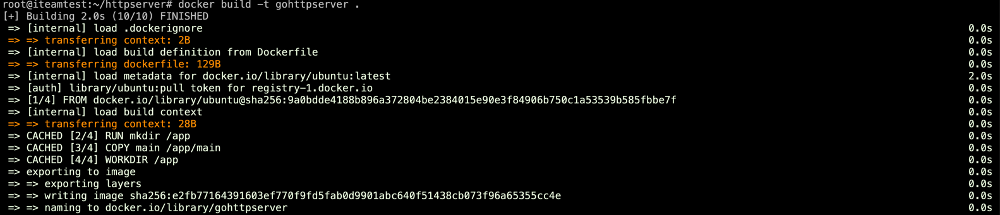
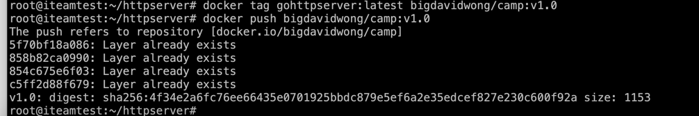
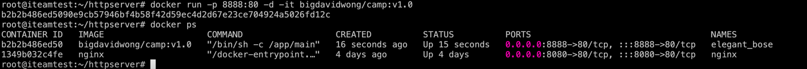
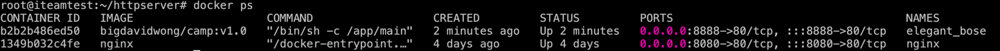
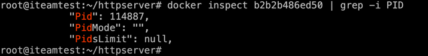
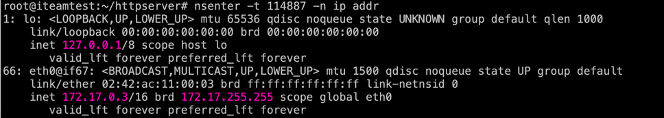

1. build Dockerfile in module3 path(include main file)
`docker build -t gohttpserver .`

2. push to docker hub;

`docker tag gohttpserver:latest bigdavidwong/camp:v1.0`

`docker push bigdavidwong/camp:v1.0`

3. docker run container;

`docker run -p 8888:80 -d -it bigdavidwong/camp:v1.0`

4. use nsenter to check ip config in container;

`docker ps`

`docker inspect b2b2b486ed50 | grep -i PID`

`nsenter -t 114887 -n ip addr`

